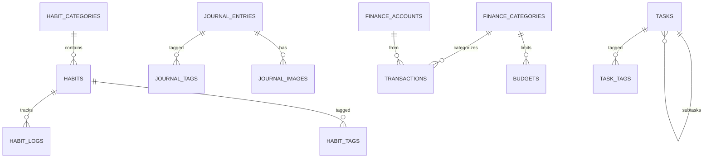

# Monolith — Architecture

> Technical reference for the full system: stack, patterns, schema, API, data flow, and security.

---

## Tech Stack

| Layer                | Technology                | Rationale                                              |
| -------------------- | ------------------------- | ------------------------------------------------------ |
| **Framework**        | Next.js 16 (App Router)   | React SSR/SSG, file-based routing, API routes          |
| **Language**         | TypeScript (strict)       | Type safety across frontend + backend                  |
| **Styling**          | TailwindCSS + shadcn/ui   | Utility-first + accessible Radix-based components      |
| **Theme**            | `next-themes`             | System-pref dark/light toggle                          |
| **Database**         | SQLite (`better-sqlite3`) | Single-file, zero-config, fast local queries           |
| **ORM**              | Drizzle ORM               | Lightweight, type-safe, SQL-like, great SQLite support |
| **Migrations**       | Drizzle Kit               | Schema-first with `drizzle-kit push`                   |
| **Full-text search** | SQLite FTS5               | Built-in, no extra dependency                          |
| **Markdown editor**  | MDXEditor or Milkdown     | WYSIWYG markdown editing + raw mode                    |
| **Charts**           | Recharts                  | Simple, composable React charts                        |
| **Encryption**       | `crypto` (Node built-in)  | AES-256-GCM for journal encryption                     |
| **Testing**          | Vitest + RTL + Playwright | Unit / integration / E2E                               |
| **Future packaging** | Tauri v2                  | Lightweight native shell                               |

---

## Architecture Pattern

**Modular Monolith** with a **Service Layer**:

```
┌─────────────────────────────────────────────┐
│                  Browser                    │
│  React UI (App Router pages + components)   │
└──────────────────┬──────────────────────────┘
                   │ fetch / SWR
┌──────────────────▼──────────────────────────┐
│          Next.js API Route Handlers         │
│    src/app/api/{module}/route.ts            │
└──────────────────┬──────────────────────────┘
                   │
┌──────────────────▼──────────────────────────┐
│            Service Layer                    │
│    src/lib/services/{module}.service.ts     │
│    (business logic, validation, crypto)     │
└──────────────────┬──────────────────────────┘
                   │
┌──────────────────▼──────────────────────────┐
│          Drizzle ORM Queries                │
│    src/lib/db/schema.ts                     │
└──────────────────┬──────────────────────────┘
                   │
┌──────────────────▼──────────────────────────┐
│             SQLite File                     │
│    %APPDATA%/Monolith/monolith.db           │
└─────────────────────────────────────────────┘
```

No repository abstraction — Drizzle queries live directly in services. Add indirection only if/when data source changes (YAGNI).

---

## Directory Structure

```
monolith/
├── src/
│   ├── app/                          # Next.js App Router
│   │   ├── (dashboard)/              # Route group — main layout
│   │   │   ├── page.tsx              # Dashboard / today overview
│   │   │   ├── habits/
│   │   │   │   ├── page.tsx          # Habit list
│   │   │   │   └── [id]/page.tsx     # Habit detail
│   │   │   ├── journal/
│   │   │   │   ├── page.tsx          # Journal entries
│   │   │   │   └── [id]/page.tsx     # Entry editor
│   │   │   ├── finance/
│   │   │   │   ├── page.tsx          # Finance overview
│   │   │   │   └── transactions/page.tsx
│   │   │   ├── vault/
│   │   │   │   └── [...path]/page.tsx
│   │   │   ├── tasks/page.tsx
│   │   │   ├── calendar/page.tsx
│   │   │   └── settings/page.tsx
│   │   ├── api/                      # API routes
│   │   │   ├── habits/
│   │   │   ├── journal/
│   │   │   ├── finance/
│   │   │   ├── vault/
│   │   │   ├── tasks/
│   │   │   ├── backup/
│   │   │   └── settings/
│   │   ├── layout.tsx
│   │   └── globals.css
│   ├── components/
│   │   ├── ui/                       # shadcn/ui primitives
│   │   ├── layout/                   # Sidebar, TopBar, CommandPalette
│   │   ├── habits/
│   │   ├── journal/
│   │   ├── finance/
│   │   ├── vault/
│   │   ├── tasks/
│   │   └── shared/                   # MarkdownEditor, CalendarWidget
│   ├── lib/
│   │   ├── db/
│   │   │   ├── index.ts              # DB connection singleton
│   │   │   ├── schema.ts             # Drizzle schema
│   │   │   └── migrations/
│   │   ├── services/                 # Business logic per module
│   │   ├── utils/                    # paths, dates, crypto, markdown
│   │   └── hooks/                    # useHabits, useJournal, etc.
│   └── types/                        # TypeScript interfaces
├── drizzle.config.ts
├── tailwind.config.ts
├── vitest.config.ts
├── playwright.config.ts
├── PROJECT.md
├── ARCHITECTURE.md
├── ROADMAP.md
└── package.json
```

---

## Database Schema

> All tables use `INTEGER PRIMARY KEY AUTOINCREMENT` for `id`, plus `created_at` / `updated_at` (`TEXT DEFAULT datetime('now')`). Soft-delete via `deleted_at` where needed.

### Settings

```sql
CREATE TABLE settings (
  key    TEXT PRIMARY KEY,
  value  TEXT NOT NULL
);
```

### Habits

```sql
CREATE TABLE habit_categories (
  id, name, color, icon, sort_order, created_at, updated_at
);

CREATE TABLE habits (
  id, name, description, category_id → habit_categories,
  frequency ('daily'|'every_n_days'|'weekly'|'monthly'),
  frequency_value, target_days (JSON), reminder_time,
  is_archived, sort_order, created_at, updated_at
);

CREATE TABLE habit_logs (
  id, habit_id → habits (CASCADE), log_date, completed, note,
  created_at, UNIQUE(habit_id, log_date)
);

CREATE TABLE habit_tags (
  id, habit_id → habits (CASCADE), tag
);
```

### Journal

```sql
CREATE TABLE journal_entries (
  id, title, content, content_encrypted, mood,
  is_prompt, prompt_text, front_matter (YAML),
  entry_date, created_at, updated_at, deleted_at
);

CREATE TABLE journal_tags (id, entry_id → journal_entries, tag);
CREATE TABLE journal_images (id, entry_id → journal_entries, file_path, alt_text, created_at);

-- Full-text search
CREATE VIRTUAL TABLE journal_fts USING fts5(
  title, content, tags, content=journal_entries, content_rowid=id
);
```

### Finance

```sql
CREATE TABLE finance_categories (
  id, name, type ('income'|'expense'), color, icon, is_default, created_at
);

CREATE TABLE finance_accounts (
  id, name, balance, currency DEFAULT 'PHP', created_at, updated_at
);

CREATE TABLE transactions (
  id, type ('income'|'expense'|'transfer'), amount, description,
  category_id → finance_categories, account_id → finance_accounts,
  to_account_id → finance_accounts,
  is_recurring, recurrence (JSON), transaction_date, tags, created_at, updated_at
);

CREATE TABLE budgets (id, category_id → finance_categories, amount, period, start_date, created_at);
CREATE TABLE savings_goals (id, name, target, current, deadline, created_at, updated_at);
```

### Tasks

```sql
CREATE TABLE tasks (
  id, title, description, is_completed, priority (0-3),
  due_date, parent_id → tasks (CASCADE), source_file,
  sort_order, created_at, updated_at, completed_at
);

CREATE TABLE task_tags (id, task_id → tasks, tag);
```

### Entity Relationships



---

## API Design

All routes: `src/app/api/{module}/route.ts` — standard Next.js Route Handlers.

### Habits

| Method   | Endpoint                      | Description                    |
| -------- | ----------------------------- | ------------------------------ |
| GET      | `/api/habits`                 | List all habits (with streaks) |
| POST     | `/api/habits`                 | Create habit                   |
| GET      | `/api/habits/[id]`            | Habit detail + logs            |
| PUT      | `/api/habits/[id]`            | Update habit                   |
| DELETE   | `/api/habits/[id]`            | Archive/delete                 |
| POST     | `/api/habits/[id]/log`        | Log completion                 |
| DELETE   | `/api/habits/[id]/log/[date]` | Remove log                     |
| GET      | `/api/habits/stats`           | Streaks + completion rates     |
| GET/POST | `/api/habits/categories`      | List / create categories       |

### Journal

| Method | Endpoint                    | Description             |
| ------ | --------------------------- | ----------------------- |
| GET    | `/api/journal`              | List (paginated)        |
| POST   | `/api/journal`              | Create                  |
| GET    | `/api/journal/[id]`         | Get entry               |
| PUT    | `/api/journal/[id]`         | Update                  |
| DELETE | `/api/journal/[id]`         | Soft-delete             |
| GET    | `/api/journal/search?q=`    | FTS5 search             |
| POST   | `/api/journal/[id]/encrypt` | Encrypt entry           |
| POST   | `/api/journal/[id]/decrypt` | Decrypt (with password) |

### Finance

| Method     | Endpoint                         | Description            |
| ---------- | -------------------------------- | ---------------------- |
| GET/POST   | `/api/finance/transactions`      | List (filter) / create |
| PUT/DELETE | `/api/finance/transactions/[id]` | Update / delete        |
| GET        | `/api/finance/summary`           | Monthly totals         |
| GET/POST   | `/api/finance/categories`        | List / create          |
| GET/POST   | `/api/finance/accounts`          | List / create          |
| GET/POST   | `/api/finance/budgets`           | Status / create        |
| GET/POST   | `/api/finance/goals`             | List / create          |

### Vault

| Method | Endpoint                | Description      |
| ------ | ----------------------- | ---------------- |
| GET    | `/api/vault/tree`       | Folder structure |
| GET    | `/api/vault/file?path=` | Read file        |
| PUT    | `/api/vault/file?path=` | Update file      |
| POST   | `/api/vault/file`       | Create file      |
| DELETE | `/api/vault/file?path=` | Delete file      |
| POST   | `/api/vault/folder`     | Create folder    |

### Tasks

| Method     | Endpoint                 | Description       |
| ---------- | ------------------------ | ----------------- |
| GET/POST   | `/api/tasks`             | List / create     |
| PUT/DELETE | `/api/tasks/[id]`        | Update / delete   |
| POST       | `/api/tasks/import`      | Import from `.md` |
| PUT        | `/api/tasks/[id]/toggle` | Toggle completion |

### System

| Method  | Endpoint                       | Description           |
| ------- | ------------------------------ | --------------------- |
| GET/PUT | `/api/settings`                | Get / update settings |
| POST    | `/api/backup/export`           | Full backup (ZIP)     |
| POST    | `/api/backup/import`           | Restore backup        |
| GET     | `/api/export/csv/[module]`     | CSV export            |
| GET     | `/api/export/markdown/journal` | MD export             |
| GET     | `/api/dashboard/today`         | Today snapshot        |

---

## Data Path Resolution

```typescript
function getDataDir(): string {
  const custom = getSettings("data_dir");
  if (custom) return custom;

  switch (process.platform) {
    case "win32":
      return path.join(process.env.APPDATA!, "Monolith");
    case "darwin":
      return path.join(
        os.homedir(),
        "Library",
        "Application Support",
        "Monolith",
      );
    default:
      return path.join(os.homedir(), ".config", "monolith");
  }
}
```

**Portable mode:** if `monolith.db` exists in the app root directory, use it instead.

---

## Security & Encryption

| Concern              | Solution                                                               |
| -------------------- | ---------------------------------------------------------------------- |
| Journal encryption   | AES-256-GCM via Node `crypto`, PBKDF2 key derivation (100K iterations) |
| Per-entry encryption | `content` field encrypted in DB; `content_encrypted` flag              |
| Vault password       | Optional master password gates the vault module                        |
| Sensitive settings   | Encrypted in settings table with master key                            |
| Network isolation    | Zero external network calls — fully offline                            |

---

## Design System Tokens

### Colors

| Token              | Light     | Dark      |
| ------------------ | --------- | --------- |
| `--bg-primary`     | `#FAFAFA` | `#1A1A1A` |
| `--bg-secondary`   | `#F5F5F4` | `#232323` |
| `--bg-elevated`    | `#FFFFFF` | `#2A2A2A` |
| `--text-primary`   | `#1A1A1A` | `#ECECEC` |
| `--text-secondary` | `#6B7280` | `#9CA3AF` |
| `--accent`         | `#3B82F6` | `#60A5FA` |
| `--border`         | `#E5E7EB` | `#333333` |
| `--danger`         | `#EF4444` | `#F87171` |
| `--success`        | `#10B981` | `#34D399` |

### Typography

| Usage    | Font              | Weight  |
| -------- | ----------------- | ------- |
| Headings | Plus Jakarta Sans | 600–700 |
| Body     | Plus Jakarta Sans | 400     |
| Code     | JetBrains Mono    | 400     |

### Layout

- **Sidebar**: collapsible, icon-only mode (`Ctrl+B`)
- **Command palette**: `Ctrl+K` global search
- **Content area**: `max-w-3xl` for text pages, full-width for dashboards
- **Cards**: `shadow-sm` only — no heavy elevation
- **Glass**: only on floating overlays (`backdrop-blur-sm bg-white/80`)
- **Transitions**: `150ms ease` on interactive elements

---

## Testing Strategy

| Level           | Tool                 | Scope                       | Run Command                                            |
| --------------- | -------------------- | --------------------------- | ------------------------------------------------------ |
| **Unit**        | Vitest + RTL         | Services, utils, components | `npx vitest run`                                       |
| **Integration** | Vitest + temp SQLite | API routes + DB roundtrips  | `npx vitest run --config vitest.integration.config.ts` |
| **E2E**         | Playwright           | Critical user flows         | `npx playwright test`                                  |

All tests use temporary SQLite files — never touch production data.
